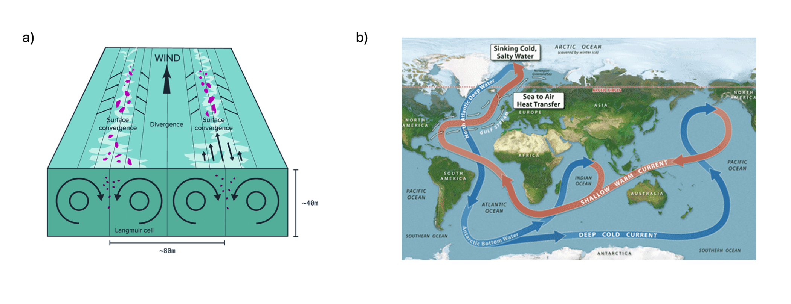
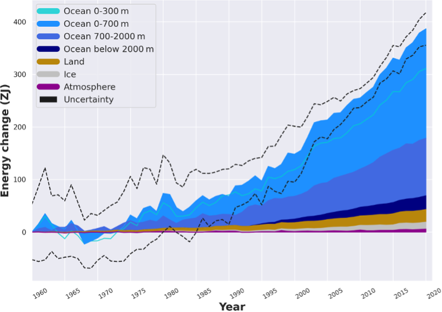
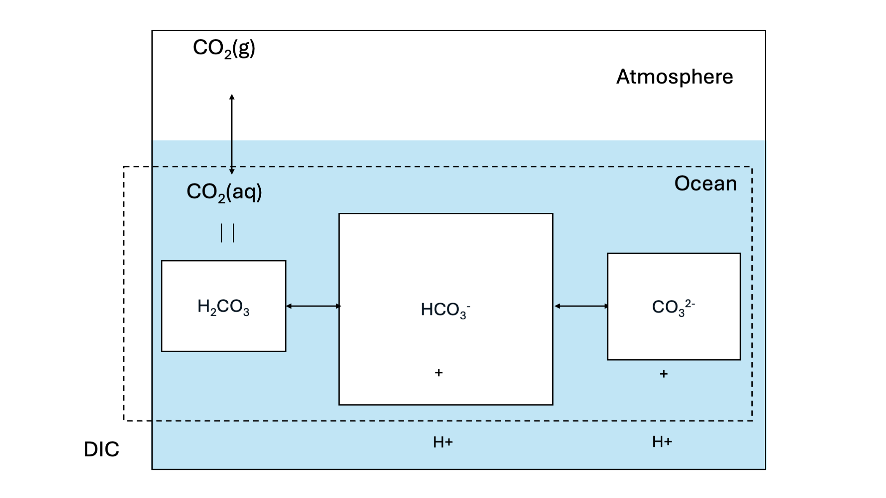
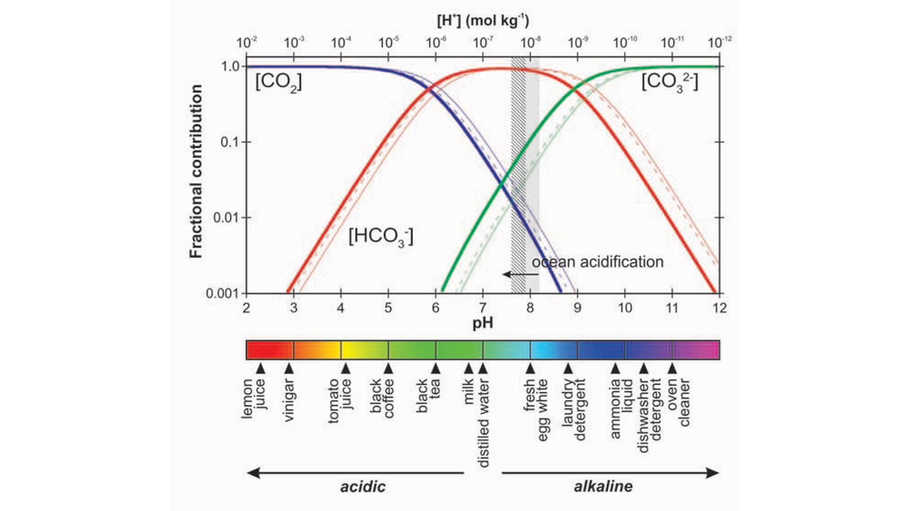
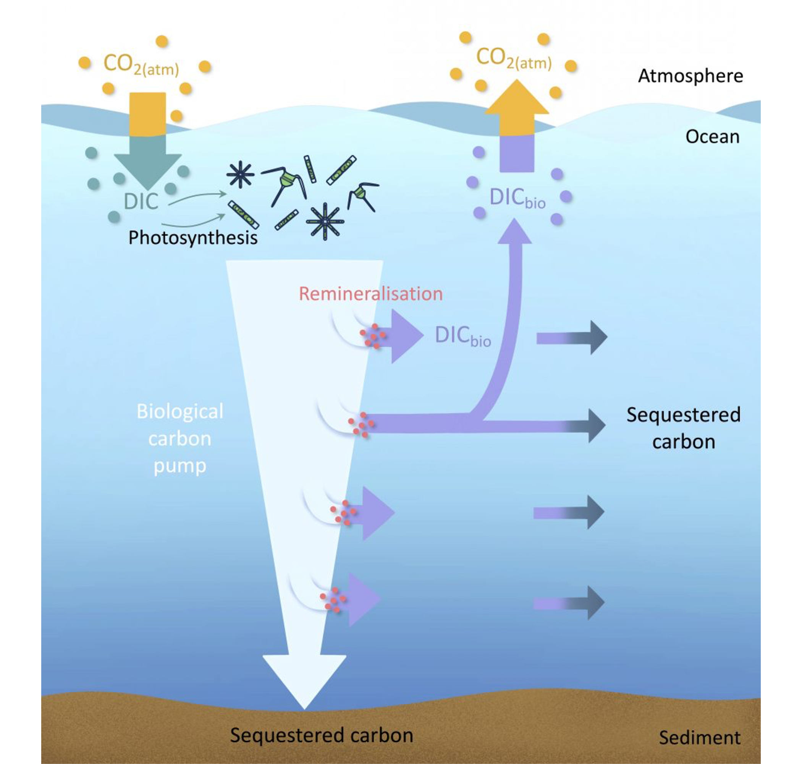
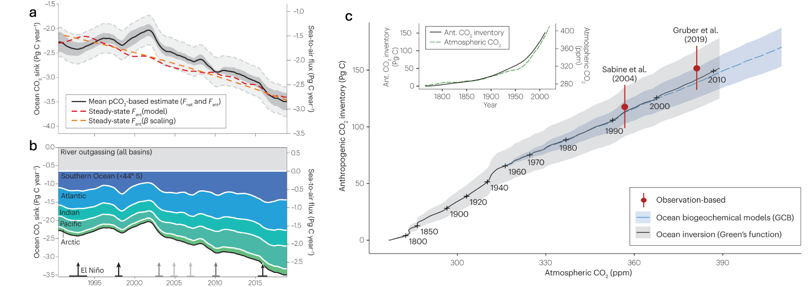
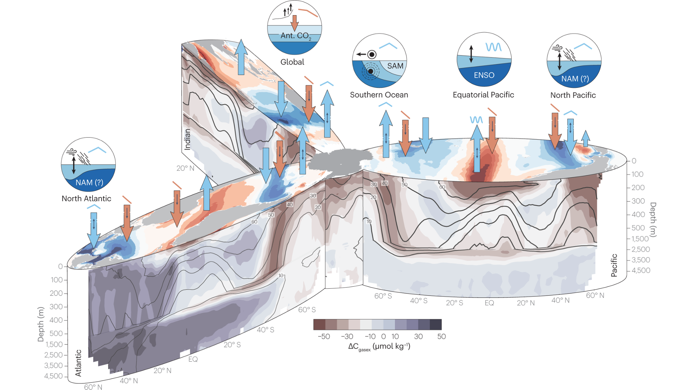

# The Ocean and its CO~2~ uptake  {#sec-oceancarbon}
## Role in the Climate System

Author: Fabrice Lacroix

The ocean constitutes of around 70 % of the Earth’s surface. It plays a vital role in the climate system through its large storage of heat and carbon [@talley2011a], provides a basis for enormous amounts of marine species, and provides important socioeconomic services vital to both regional and global economies, global food supply and human wellbeing. 

Since the preindustrial time period, the ocean has taken up and stored over 90 % of excess anthropogenic heat, which arises from the Earth's atmosphere energy imbalance induced by rising greenhouse gas concentrations. It also buffers the atmospheric rise in greenhouse gas concentrations due to human emissions, since it accounts for an uptake of around 30 % of global anthropogenic carbon emissions [@friedlingstein24essd]. Both of its uptake of heat and carbon mean that increasing atmospheric CO~2~ concentrations and climate warming would be substantially more severe without the role of the ocean in the climate system.  

The ocean serves as a habitat for numerous marine species, and is important for socioeconomic services, with over 40 % of the global population living within a range of 100 km from the coast. Climate warming and other human-caused disruptions, such as eutrophication, are affecting this vital space on Earth, and endangering its ecosystems, such as corals.

The importance of the ocean in regulating the climate and its multidimensional anthropogenic drivers change, is essential for a closer understanding of how the climate is changing and its impacts. 

## Stratification and Ocean Circulation

Ocean mixing and circulation governs its uptake, transport and storage of heat and carbon between latitudes. It is also important for its transfer from the surface ocean, which is in close exchange with the atmosphere, to the deeper ocean, which consists of the long-term storage component of the ocean. Since the ocean is for the most part well stratified, meaning that waters of low density sit above waters of low density @fig-stratification. In such a case, the exchange between surface and deeper ocean is limited. The amount of heat and carbon that can reach the deeper ocean and be stored in this large deeper volume, is thus strongly limited. However, there are also areas where surface waters are mixed into the deeper ocean, called areas of deep convection, which play a significant role for ocean carbon and heat storage. These areas, where waters can penetrate to over 1000m depth (usually the mixed surface layer is around 100m on average), are found in the North Atlantic and Southern Ocean[@talley2011a]. Here, the cooling of surface waters increase their densities, making them heavier and more likely to sink. Changes in salinity, owing to precipitation, evaporation or sea ice melt/formation, also impact water densities and the rate to which surface waters can enter the ocean. 

```{r echo=FALSE, eval=TRUE}
#| label: fig-stratification
#| fig-cap: "Scheme of stratified ocean (left) and deep convection areas (right)."
#| out-width: 100%
knitr::include_graphics("images/ocean_stratification.png")
```

Ocean circulation in the surface ocean is largely driven by winds (@fig-circulation a). For instance, coastal currents off the coast of Portugal are driven by winds, as well as subtropical gyres. An interesting phenomena of wind-driven circulation, is that waters are always transported at an angle of 90° to the wind, owing to combined wind stress and the Earth's rotation. An interesting and biologically-important example of this is found in Eastern Boundary Upwelling Systems (EBUS), where coastal parallel winds drive waters from the coast. To compensate this horizonal flow away from the coast, waters are drawn up from below. Since these waters are not only cold, but also nutrient rich, EBUS areas are zones of highest marine productivity globally. Reconstructions of surface circulation based on satellite retrievals of temperature, heat and salinity fields were performed by [NASA](https://svs.gsfc.nasa.gov/10841/#media_group_350679).

There is also a slower and thorough large-scale circulation driven by density gradients in the ocean, which essentially mixes the entire ocean. This slow circulation with a timescale of over one thousand years is referred to as thermohaline circulation, and it constitutes of both flows at the surface (for instance the Gulf Stream), which convects into the deeper ocean in both Atlantic and Pacific/Southern Ocean (@fig-circulation b). Deep ocean streams end up in the Southern Ocean after hundreds of years, where they eventually resurfaces.   

```{r echo=FALSE, eval=TRUE} 
#| label: fig-circulation
#| fig-cap: "Drivers of ocean circulation. Panel a shows the mechanisms leading to wind-driven circulation and mixing, from @talley2011b. Panel b shows the slow circulation through the entire ocean driven by density gradients (thermohaline circulation), Source WikiComms." 
#| out-width: 100% 
 
``` 

## Ocean Heat Uptake

The ocean has taken up hundreds of ZJs of heat since the preindustrial time period as a result of the increasing Earth energy imbalance caused by greenhouse gas emissions (@fig-heatuptake). The ocean's large role for heat storage is due to the physical characteristics of water, combined with its large-scale circulation and vast storage volume. Its large heat capacity (C~p~ = 4’184 J kg^-1^ °C^-1^) allows for larger storage of heat per volume at a given temperature than all other liquids and solids, with the sole exception of NH~3~. 

Heat is taken up through air-sea exchange at the ocean's surface. The surface ocean is thus the largest storage term of anthropogenic heat, but part of it is also transferred to the voluminous deeper ocean, where it is stored over the long-term due to very slow circulation at greater depths. This heat in the deep ocean remains isolated from any contact with the atmosphere for centuries, making the process very important in the context of climate change. 

Due to the expansion of water with increasing temperature, ocean heat uptake is responsible for around half of historical changes in sea level, with the other half arising from enhanced freshwater inputs to the ocean through glacier runoff, icesheet and sea ice melting. Strong increases in temperature caused by heat uptake also can have adverse effects on marine organisms through thermal stress, for instance causing the bleaching of corals, or by reducing the amount of oxygen available for aerobic species, such as fish. Temperature also influences carbon exchange as shown in the following subsection.  

```{r echo=FALSE, eval=TRUE}
#| label: fig-heatuptake
#| fig-cap: "Change in energy inventory for different components of the Earth's climate system from 1960 to 2018, in ZJ. From @schuckmann2023"
#| out-width: 75%

``` 

## Ocean Carbon Fluxes

The ocean is also the largest reservoir of carbon. Its uptake of CO~2~ plays an important role in regulating the Earth's climate, which is relevant to current climate change, as well as paleo climate events. An overview of carbon fluxes is given in figure [@fig-oceancarbon].  

```{r echo=FALSE, eval=TRUE}
#| label: fig-oceancarbon
#| fig-cap: "Quantative overview of ocean carbon pools and fluxes. Natural fluxes are given in black, anthropogenic perturbation in red. From @resplandy2026"
#| out-width: 75%
knitr::include_graphics("images/sciadv.aed2480-f3.jpg")
``` 

The uptake of CO~2~ by the ocean occurs through surface exchange between ocean and the atmosphere. Thus the dissolution of atmospheric CO~2~ into seawater is driven by two distinct processes pathways: carbonate chemistry (solubility pump) and biological fluxes (biological pump). The former comprises of the chemical balance of inorganic carbon in seawater, whereas the latter is driven by uptake of carbon via photosynthesis and the degradation (remineralization) of this organic matter in the ocean. Both are greatly important for natural carbon fluxes in the ocean, but the uptake of anthropogenic CO~2~ is thought to be currently dominated by the solubility pump, which is driven by dissolution and carbonate chemistry (Resplandy et al., 2026). 

### Carbonate chemistry (Solubility Pump)

Carbonate chemistry is a major driver of carbon storage in the ocean and the dominant pathway of anthropogenic CO~2~ uptake by the ocean through its "Solubility Pump" [@fig-carbonatechem].

```{r echo=FALSE, eval=TRUE}
#| label: fig-carbonatechem
#| fig-cap: "Carbonate chemistry and the solubility pump of the ocean, based on @williams2011 ."
#| out-width: 85%

```

Firstly, gaseous CO~2~ in the atmosphere can dissolve into seawater. This process is driven through the equilibrium states of gaseous CO~2~ and dissolved CO~2~ concentration in sea water. The equilibrium of gaseous CO~2~ in the atmosphere and dissolved CO~2~ in seawater is dictated by Henry’s law: 

$$
\begin{align}
\frac{CO_{2,(aq)}}{pCO_{2}} \Leftrightarrow K_{H} 
\end{align}
$$ {#eq-henry_law}

Applying only Henry’s law with K~H~ = 3.4 × 10^−2^  and pCO~2~ = 400 ppm would however lead to a 100-fold underestimation of carbon storage in the ocean. This is because of the buffer effect caused by the carbonate system. Dissolved CO~2~ and water firstly form H~2~CO~3~. At sea water pH levels however, the majority of newly formed H~2~CO~3~ dissociates to bicarbonate HCO~3~^-^:

$$
\begin{align}
CO_{2} + H_{2}O  \Leftrightarrow H_{2}CO_{3}
\end{align}
$$ {#eq-h2co3}

$$
\begin{align}
H_{2}CO_{3} \Leftrightarrow HCO_{3}^{-} + H^{+}
\end{align}
$$ {#eq-hco3}

The equilibrium of the reaction is thus given by:

$$
\begin{align}
pK_{a} =  \frac{[HCO_{3}^{-}] * [H^{+}]}{CO_{2}]} = 3
\end{align}
$$ {eq-eq_hco3}

This reaction is very favorable at oceanic pH levels with a pKa of 3, meaning a much larger fraction of $HCO_{3}^{-}$ than $H^{+}]}{CO_{2}$. 

The bicarbonate ($HCO_{3}^{-}$) can further dissociate to CO3^2-^:

$$
\begin{align}
HCO_{3}^{-} \Leftrightarrow CO_{3}^{2-} + H^{+}
\end{align}
$$ {#eq-co3}

With the equilibrium of the reaction given by:

$$
\begin{align}
pK_{2} =  \frac{[CO_{3}^{2-}] * [H^{+}]}{HCO_{3}^{-}]} = 10.3
\end{align}
$$ {#eq-eq_co3}

Although this reaction is not favorable at oceanic pH levels at a pKa of 10.3. The sum of all carbonate species (CO~2(aq)~, H~2~CO~3~, HCO~3~^-^, CO3^2-^) comprises dissolved inorganic carbon (DIC). @fig-dicspeciation shows the fraction of the different DIC species to the total DIC as a function of solute pH. The figure shows that at a pH level typical for seawater (around pH=8.1), the majority of DIC is present under the form of HCO~3~^-^. This means that with higher atmospheric CO~2~, the increased CO2(aq) will quickly react to form HCO~3~^-^, allowing for more atmospheric CO~2~ to be dissolved in the water. The mechanism is referred to as carbonate buffering. 


```{r echo=FALSE, eval=TRUE}
#| label: fig-dicspeciation
#| fig-cap: "Fraction of different DIC species (O~2(aq)~, H~2~CO~3~, HCO~3~^-^, CO3^2-^) to total DIC, from @barker2012."
#| out-width: 85%

```

A byproduct of equations @eq-h2co3 and @eq-hco3 is the increase of seawater hydrogen ions (H^+^) concentrations are increased, which is referred to as acidification. Acidification is notable to reduce rates of CO~2~ uptake due to reducing the carbonate buffer of the ocean, and have adverse effects on organisms such as corals.

Generally, the buffering capacity of the ocean through carbonate chemistry is referred to as carbonate alkalinity. While alkalinity in general is the sum of bases minus acids in a solution, carbonate alkalinity (A~c~) can be reduced to: 

$$
\begin{align}
A_{c} = HCO_{3}^{-} + CO_{3}^{2-}  + OH^{-} - H^{+}
\end{align}
$$ {#eq-ac}

Higher alkalinity means that the ocean can better compensate for an increase of H^+^.

The carbonate system is firstly affected by temperature, which pushes the speciation equilibrium of @fig-dicspeciation to the left, meaning that less CO~2~ can be stored in seawater with higher temperatures. In addition, @fig-dicspeciation also directly shows that a lower pH, meaning higher acidification, the buffer capacity of the ocean is reduced, reducing its potential to take up CO~2~.  


### Biological Fluxes (Biological Pump)

Algae in the ocean takes up dissolved carbon in the ocean through photosynthesis. In the photosynthesis process, organic carbon is produced by algae, using water and dissolved CO~2~ from the sea water. The produced biomass can in turn be respired during maintenance or autotrophic repiration of the algae, or after excretion or mortality, by zooplankton or bacteria, and returned to the ocean as dissolved inorganic carbon (remineralization, @fig-biopump). Carbon stored through the biological production of organic carbon is generally only lost from exchange with the atmosphere once the organic carbon particles sink to deeper depths, where waters are not mixed with the surface any longer . This sinking of the carbon is isolated from exchange with atmosphere over long timescales of thermohaline circulation, and can even be deposited and buried in the sediment. The loss of carbon from the atmosphere through this chain of biological processes is referred to as the "biological pump".

```{r echo=FALSE, eval=TRUE}
#| label: fig-biopump
#| fig-cap: "Biological carbon uptake and mineralization in the ocean. The total loss of carbon from the atmosphere through this pathway is called the biological pump. Source: US-OCB. "
#| out-width: 55%

```

Biological productivity in the ocean is strongly limited by light availability and nutrient concentrations. As a result, biological productivity is only found in the euphotic zone of the ocean, which is defined as depths to which light penetrates into the ocean and usually reaches around 100 m depth. [Spatial patterns of productivity](https://svs.gsfc.nasa.gov/vis/a030000/a030700/a030786/modis_chlor_a_perceptual_720p.mp4) in the ocean show a large degree of seasonality due to the light limitation. However, "deserts" of biological productivity can be found in multiple areas of the ocean, which then owes to lack of nutrient supply. For instance, subtropical areas remain extremely low in productivity all year around due to low nutrient availability. In contrast, coastal areas where deeper waters supply vast amounts of nutrients (e.g. Californian coast, around the Canary islands, coast of Peru and Namibia) are some of the most biologically active areas in the ocean.

Past and future changes in the biological drawdown and storage of carbon in the ocean remains strongly uncertain, despite it’s large natural fluxes. While models generally agree that the biological productivity will decrease with additional climate warming, the magnitude of this decrease is strongly variable.

## Ocean Carbon Sink

The ocean is responsible for around 25 % (2.7 Pg C yr^-1^) of anthropogenic carbon uptake. This carbon sink has steadily increased over time with atmospheric CO~2~ concentrations, the primary driver of this increasing carbon flux to the ocean.  Historical model and inversion data show minor saturation of the carbon sink can be observed over the historical time period (@gruber2022), which could owe to impacts of increasing temperature and acidification on the sink driven by carbonate chemistry. Figure @fig-spatialcarbon  shows areas of the natural CO~2~ flux in different basins of the ocean (blue) and the anthropogenic perturbation of the CO~2~ flux (red).  

```{r echo=FALSE, eval=TRUE}
#| label: fig-carbonuptake
#| fig-cap: "Ocean carbon uptake. Panel a shows the cumulative global ocean carbon uptake over time. Panel b shows the cumulative global ocean carbon uptake in different basins. Panel c shows the relationship of cumulative global ocean carbon uptake with atmospheric CO~2~ levels, from @gruber2022."
#| out-width: 100%

```

Research has shown that ocean areas that contribute disproportionally to the ocean carbon sink are regions where waters are cooled by the atmosphere and which can generate very deep mixing. For instance, in the North Atlantic and Southern Ocean, surface waters can be mixed to hundreds of meters below the surface. The response of such regions to atmospheric warming, or increased stratification with icesheet melting, which could disrupt the deep mixing of these waters, could strongly disrupt the ocean storage of carbon, and is thus an important area of research. 

```{r echo=FALSE, eval=TRUE}
#| label: fig-spatialcarbon
#| fig-cap: "Basin profile showing natural carbon exchange of ocean regions with atmosphere (blue arrows), anthropogenic carbon uptake (red arrow), and anthropogenic carbon storage in the ocean (concentrations in the profile), from @gruber2022 ."
#| out-width: 85%

```

::: {.callout-caution}
## Exercise

1. Compute wind stress for different wind speeds of 0,5,10,15,25,30 ms^-1^ with the following equation:
$$
τ = ρ * C_{d} * W 
$$

     with density of air = 1.3 kg m^-3^ 
     Cd = Drag coefficient = 1.4 x 10^-3^ m^-3^
     W = wind speed in ms^-1^

Make a plot with windspeed on X-axis and wind stress on Y-axis.

2. Compute the heat uptake of the surface ocean since 1960 assuming: a density of 1,025 kg/m^-3^, a volume of 3.6 × 10^16^ m^-3^, and a temperature rise of 0.5 °C. 

3. How much DIC would be dissolved in the ocean following solely Henry's law, thus ignoring further buffering through carbonate chemistry?

4. What is the concentration of DIC (in [mol kg^-1^]) dissolved in the surface ocean in mol kg^−1^ (assuming full carbonate chemistry, and neglecting biological fluxes), assuming an equilibrium state, pCO~2~ = 278 10^-6^ atm and a pH of 8.1. Combine both equations \@ref(eq-eq_hco3) and \@ref(eq-eq_co3). Compare this answer with the answer in 3. 

5. How much DIC (in [g C]) is stored in the surface ocean in absolute terms? Assume a surface ocean depth of 100 m, a surface of 3.16 × 10^14^ m^2^, a density of density of seawater ρ0 = 1024.5 kg m^−3^, and a molmass of 12 g C mol^-1^. Use the DIC concentration calculated in 3., or if not solved, use [DIC]= 2000 × 10^−6^ mol kg^−1^. (1 P)

6. Describe how the oceanic biological carbon pump can respond to climate warming? What are the implications of this change?
 
::: 
